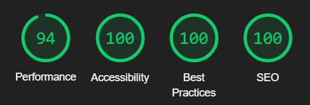

# TV-Series

Just a little web app that shows the most popular TV series of the week extracted from the MovieDB API.

For true fans of TV series!

<h2>Feature:</h2>

<ul>
<li> List always updated</li>
<li> Series overview and platform</li>
<li> Multi-languages support:</li>
    <ul>
    <li> Italian</li>
    <li> English</li>
    <li> And more to add!</li>
    </ul>
<li> Netflix style theme with high contrast</li>
<li> Responsive Design for common devices</li>
<li> Fully made in HTML, CSS and Vanilla Js
</ul>

<h2>Performance</h2>

>  Tested with Lighthouse on Google Chrome

Do you like the app or have a suggestion? Send me a feedback!
